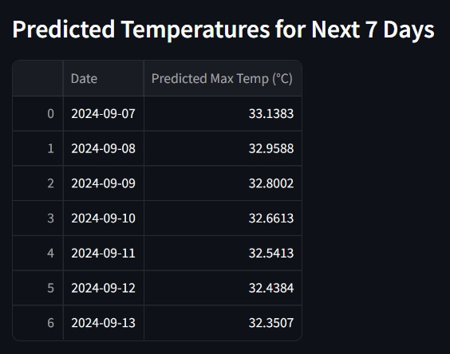
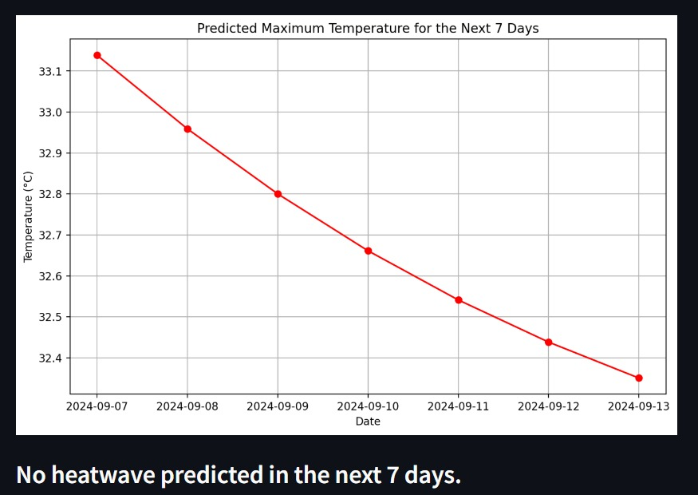

# Heatwave Prediction App

This repository contains a Streamlit application that predicts maximum temperatures for the next 7 days using historical weather data and a GRU-based machine learning model. The app also checks if a heatwave is predicted based on the temperatures for the upcoming days.

## Features

- **Fetch Historical Weather Data**: The app retrieves historical weather data using the [WeatherAPI](https://www.weatherapi.com/).
- **GRU-Based Model**: A GRU (Gated Recurrent Unit) model is used to predict maximum temperatures for the next 7 days.
- **Heatwave Alert**: The app checks if a heatwave is predicted based on consecutive high temperatures.
- **Interactive Visualization**: Displays predicted temperatures and provides a heatwave alert if necessary.

## How It Works

1. **Data Collection**: The app fetches historical weather data for the past year using WeatherAPI.
2. **Feature Selection**: The selected features include `max_temp`, `avg_temp`, `humidity`, `heat_index`, and `uv`.
3. **Model Training**: A GRU-based neural network is trained on the historical data to predict maximum temperatures.
4. **Prediction**: The trained model predicts the maximum temperature for the next 7 days.
5. **Heatwave Check**: The app checks if the predicted temperatures exceed 40°C for 3 or more consecutive days, indicating a heatwave.


# Installation

1. Install Dependencies: Make sure you have Python 3.7+ installed. Then install the required packages:

```bash
pip install -r requirements.txt
```

API Key:

- Sign up at WeatherAPI to get your API key.
- Replace the API_KEY in app.py with your WeatherAPI key.

Run the Application:

```bash
streamlit run app.py
```
Files in This Repository

- train_and_save_model.py: Script for training the GRU model and saving it along with the scaler.
- app.py: The main Streamlit application.
- requirements.txt: List of dependencies required to run the app.
- heatwave_model.h5: The pre-trained GRU model.
- scaler.pkl: The MinMaxScaler used to normalize the data.

Deployment
This app is deployed on the Streamlit Community Cloud. You can access it [Link]()




Usage
Once the app is running, it will:

- Fetch the latest historical weather data.
- Predict maximum temperatures for the next 7 days.
- Display the predicted temperatures.
- Alert you if a heatwave is predicted.
